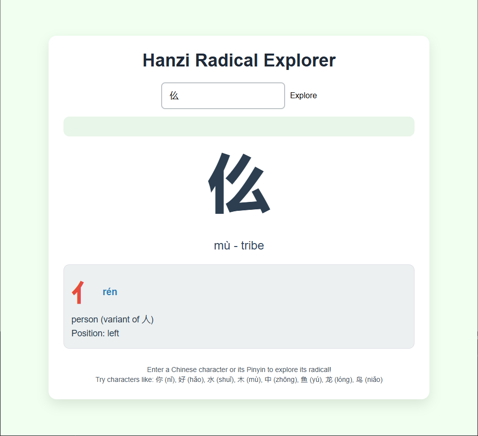

This is a web-app capable of finding the definition and linked radical of around 9500 Chinese characters.

characters_data.json is a data-readable JSON file of 9500 most used Chinese characters, accompanied by their definitions and their corresponding radicals.
It was extracted from the GitHub for "Make Me a Hanzi" (https://github.com/skishore/makemeahanzi)'s dictionary.txt file, downloaded as raw data into JSON format in characters_data.json. 

characters_data.json is actually to my knowledge the first large-scale, JSON-native, analysis-ready dataset for Chinese characters with radicals, definitions, and components — directly usable in flashcard apps, APIs, and other tools without pre-processing. 
most alternatives are:
- Unstructured (TSV, XML, etc.)
- Partial (e.g. no radicals)
- Locked behind licenses

and this is absolutely free! You are free to use characters_data.json as you wish.

radicals_details.json is all the radicals in all their forms
_________________________________________________________________________________________________

**The actual app itself**

The text box has an integrated pinyin keyboard, from which you can choose Chinese characters, many of which will be referenced in characters_data.json (many aren't as characters_data.json contains about 9500 Chinese 
characters, which is much less than accessible with the pinyin keyboard). Once you see your chosen Chinese character in your keyboard, you can click on it and you will be met with its definition and radical it is 
indexed under
